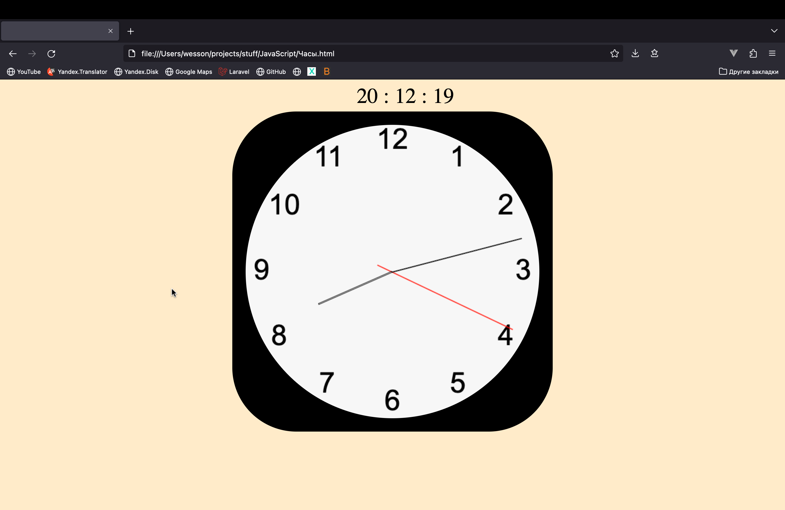
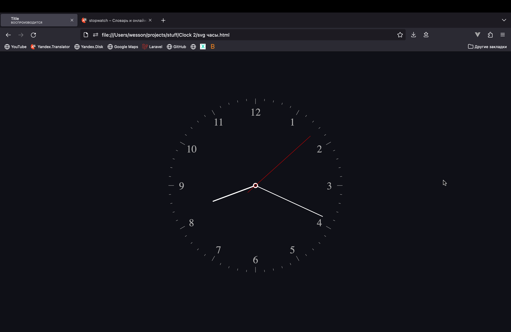
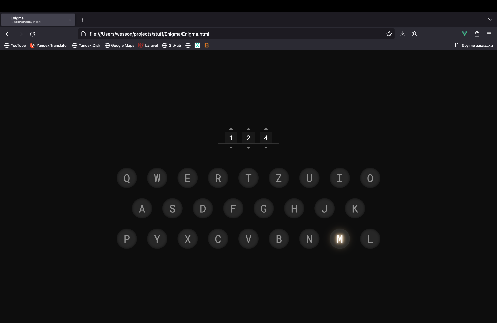
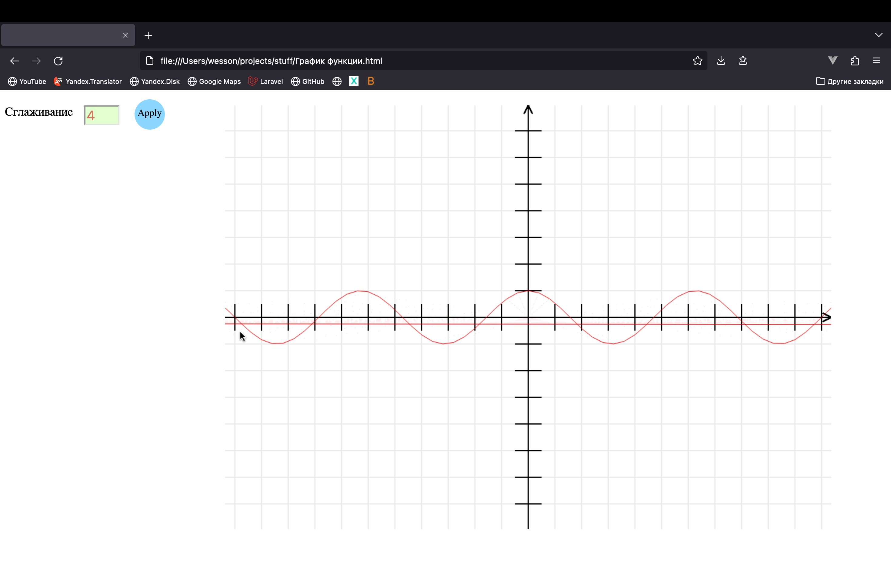
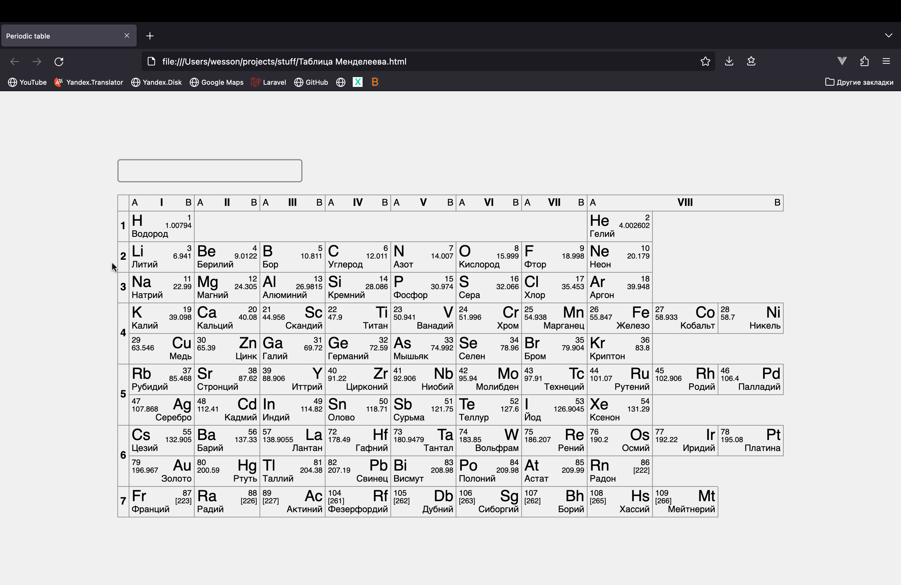
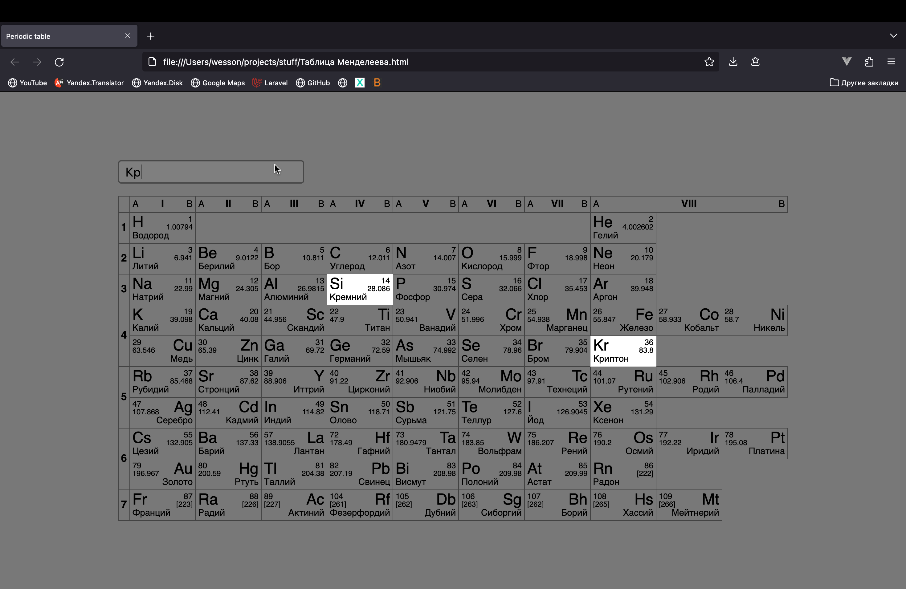
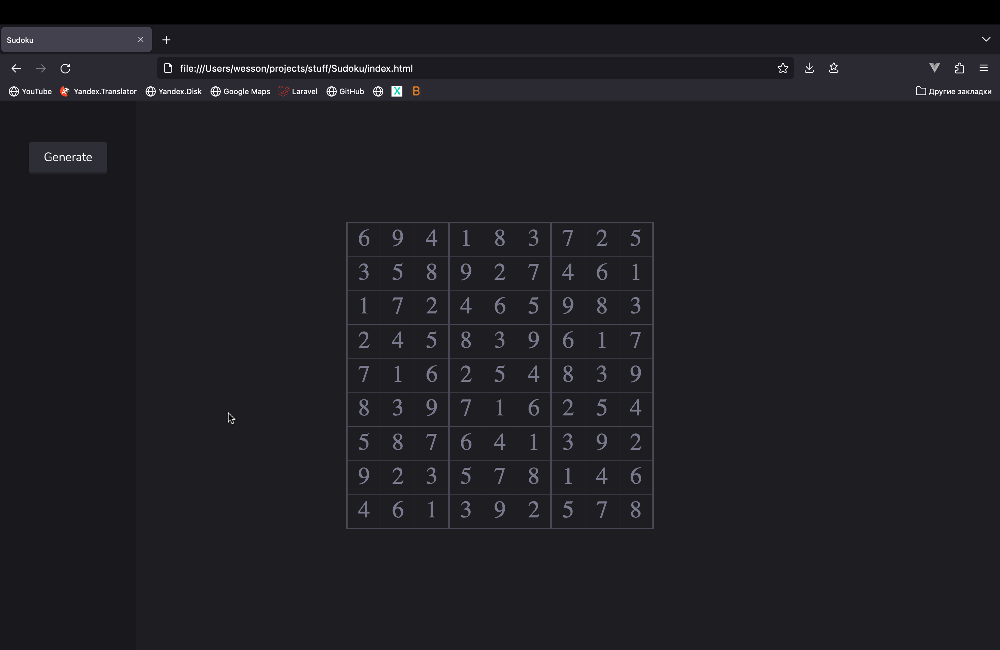
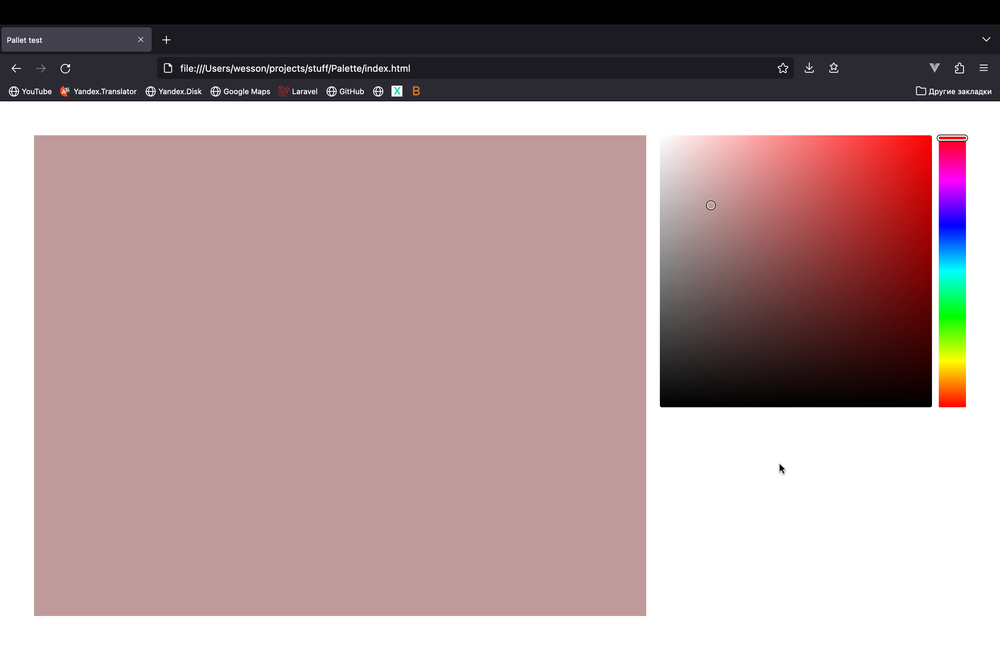
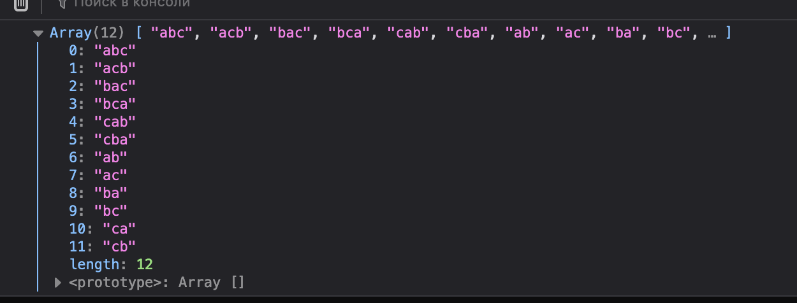
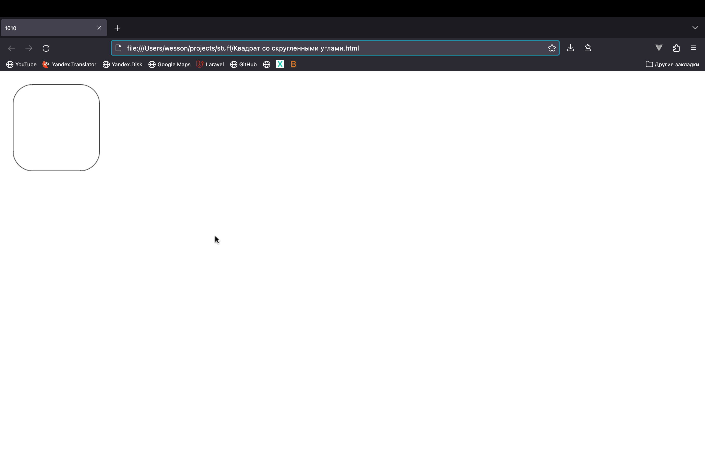

## Разные скриптики которые Я писал чисто по фану в школе и универе
Весь этот хлам долго валялся у меня на яндекс диске, но Я решил немного это приоформить, оставить самое, на мой взгляд, интересное и выложить в гитхаб, чтобы время от времени вспоминать с чего все началось. Код, конечно, написан весьма плохо, но с другой стороны, у меня не было никого, кто бы мог помочь или наставить, так что судить здесь нечего.

### Clock 1.html
Один из самых первых моих школьных скриптов. С этим проектиком Я тогда познавал тригонометрию

### Clock 2/index.html
Чуть позже решил повторить часы, но уже с svg (они даже тикают, надо только включить звук в браузере)

### Enigma/Enigma.html
Наверное, мой любимый проект. Накануне Я посмотрел фильм про Тьюринга "Игра в имитацию" и меня очень впечатлила энигма. Я решил сделать ее симулятор. При нажатии клавиши на клавиатуре, загорается "лампочка" с буквой, которая является частью шифра.

### График функции.html
Рисует заданную (в коде) математическую функцию (плохо работает с прирывистыми функциями типа тангенса)

### Таблица Менделеева.html
Была сделана на первом курсе (когда шел курс химии). Хотел сделать такую полноценную интерактивную шпору, но смог реализовать только поиск по элементам.

### Sudoku/index.html
Достаточно долго Я никак не мог придумать алгоритм расчета числовой сетки для игры sudoku, но все же Я это сделал

### Palette/index.html
Просто колор пикер, опять же по фану

### combinatorics.html
Берет строку и перебирает все возможные сочетания букв. Когда-то Я нашел мобильную игру, где из предложенных букв надо было собрать как можно больше слов. Этот скрипт еще подгружал словарь и искал слова из получавшихся наборов букв, но Я его не нашел(

### Квадрат со скругленными углами.html
Да, тупо квадрат, но Я решил вставить его сюда за то, как он отрисован (в исходнике). Врят ли кто-то еще занимался такой фигней

